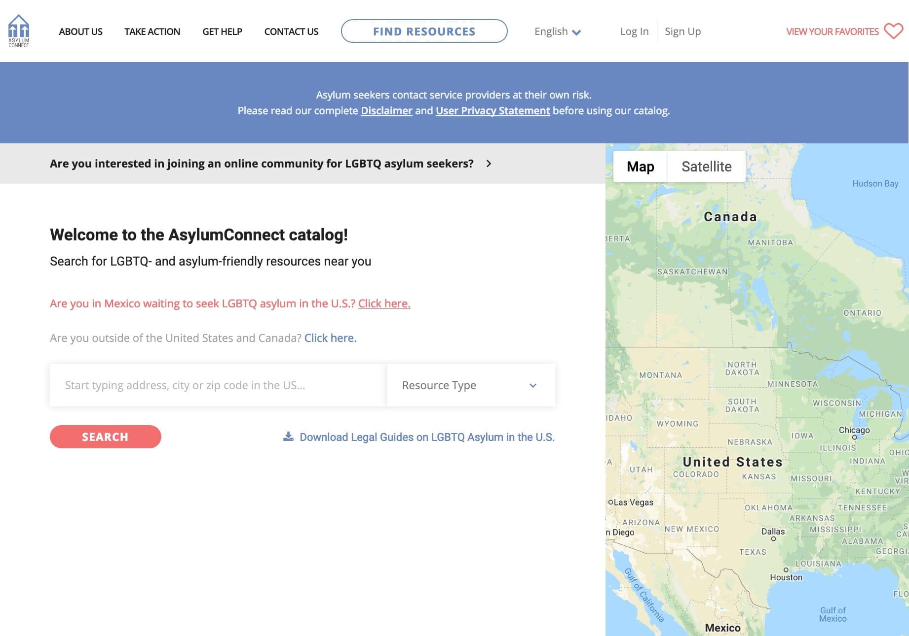

import ExternalLink from '../src/components/ExternalLink'

The AsylumConnect catalog currently helps LGBTQ asylum seekers find safe resources during the U.S. asylum process. 

I volunteered on this project as an Associate Web Developer from the application's start to its launch. I was able to contribute about 10+ hours / week for approximately 3 months.

### Some Tech I Learned 

##### [React](https://reactjs.org) a JavaScript library for building user interfaces
I built 20+ reusable components and architected global application states, such as error messages and dialogs.

##### [One Degree](https://data.1degree.org) api for discovering community resources
I wrote a library for managing client-side API requests to One Degree. It was my first experience architeching session-management and using JWT.
